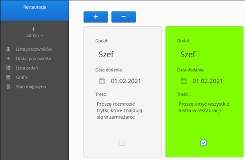
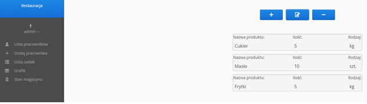

# Restaruation management system
This is my first project created in Spring Boot.
A system to help restaurant employees manage their work. 

## Used technologies
Project is created using Spring Boot, MySQL database and frontend was created in Vaadin 8.

## Functionality
I constantly add functionality to this website to provide best user experience. So far I added:
  - user authentication created with Spring Security
  - workers accounts and manager accounts that can manage
  - list of tasks for employees  
  - schedule for employees
  - warehouse status, where you can manage resources
  - list of current employees
  - account settings, where you can change basic information
  
## Screenshots

## Vaadin Addons
### SideMenu
https://vaadin.com/directory/component/sidemenu-add-on

  
